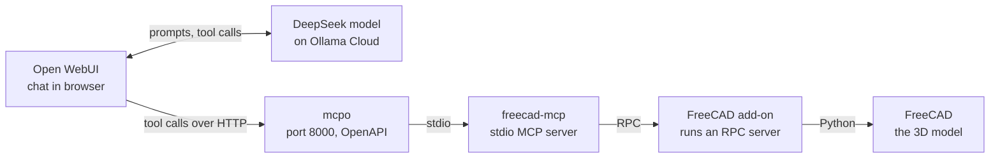

# Connect Open WebUI to FreeCAD on Linux Mint

Last updated 2026-10-08 - @SK

Tested in October 2026.

## Why I built this

I was stunned by [a MakeForm video of Claude building parts in FreeCAD from plain-English prompts](https://www.youtube.com/watch?v=6trAkQY5_kc). The prompts were short and mostly plain language, and each part was built faster than I could have modeled it myself.

That made me wonder whether I could replicate the setup, but with open-source applications wherever possible.

## How a prompt becomes a part

Here is what happens between typing a prompt and seeing a part in FreeCAD. I follow one real prompt from my testing:

```text
Create a box in FreeCAD with length 50mm, width 30mm, height 20mm.
```



*How the parts connect*

1. **I type the prompt in Open WebUI,** which runs in my browser.
2. **Open WebUI sends it to the model.** The DeepSeek model runs on Ollama Cloud. Open WebUI also sends the list of tools the model may call, including the FreeCAD tools.
3. **The model answers with a tool call,** not a finished part. For the box, that is a call such as `create_object` with the dimensions as arguments. For harder parts, it often writes Python and sends it through `execute_code`.
4. **Open WebUI passes the call to mcpo** over HTTP.
5. **mcpo hands it to `freecad-mcp`** over stdio (Claude Desktop does this step by itself in MakeForm's setup, but Open WebUI cannot, which is why mcpo sits in between).
6. **`freecad-mcp` sends it to the add-on's RPC server** inside FreeCAD, which runs the commands through FreeCAD's Python API.
7. **FreeCAD builds the box.** The add-on returns a text confirmation, which goes back up the same route to the model. Tools such as `create_object` also attach a screenshot of the viewport to that reply, and the model can ask for a fresh one at any time with `get_view`.
8. **The model reads the result.** It either makes another tool call or tells me what it built.

This cycle (items 3 to 8) repeats for every operation, which is how a part gets built up one step at a time.

## Putting this all together

### My setup

| Item | Requirement | Version I used |
| --- | --- | --- |
| Operating system | Linux Mint 22.x, 64-bit (Intel or AMD) | Linux Mint 22.2 (x86_64) |
| Python | 3.11 or 3.12, for Open WebUI (Step 1) | 3.12 |
| curl | Used by the uv installer (Step 3) | 8.5.0 |
| Open WebUI | Installed with pip (Step 1) | v0.11.4 |
| Ollama | Installed, with an account at ollama.com for cloud models | 0.21.2 |
| FreeCAD | A current 1.x release, installed as an AppImage (Step 2) | 1.1.4 |
| FreeCAD MCP add-on | Downloaded from GitHub and copied into FreeCAD's Mod folder (Step 4) | 0.1.25 |
| mcpo | Run with uvx, with mcp pinned below version 2 (Step 6) | 0.0.20 |
| Internet | Required, because the model runs on Ollama Cloud | n/a |

### Step-by-step installation

1. Install Open WebUI
2. Install FreeCAD
3. Install uv
4. Install the FreeCAD MCP add-on
5. Sign in to Ollama Cloud and pull the model
6. Run mcpo
7. Connect Open WebUI
8. Test it, including the screenshot check

Note: Steps 1, 2, 3 and 5 can be done in any order. Step 4 needs Step 2, Step 6 needs Steps 3 and 4, Step 7 needs Steps 1, 5 and 6, and Step 8 needs all the steps before it.

#### Step 1: Install Open WebUI

1. Check that Python is 3.11 or 3.12. The Open WebUI Quick Start did not list 3.13 as supported when I checked in October 2026:

   ```bash
   python3 --version
   ```
2. Create a virtual environment named `open-webui-env` in the home directory (`~/open-webui-env`):

   ```bash
   python3 -m venv ~/open-webui-env
   ```
3. Activate it:

   ```bash
   source ~/open-webui-env/bin/activate
   ```
4. Install Open WebUI, following the Python (pip) instructions in the official [Open WebUI Quick Start](https://docs.openwebui.com/getting-started/quick-start/):

   ```bash
   pip install open-webui
   ```
5. Start Open WebUI, and open `http://localhost:8080` in a browser:

   ```bash
   open-webui serve
   ```

**Checkpoint:** Open WebUI opens in the browser, and you can create the admin account.

#### Step 2: Install FreeCAD

FreeCAD is the open-source 3D CAD application that the model controls.

1. Go to [freecad.org/downloads.php](https://www.freecad.org/downloads.php) and download the Linux x86_64 AppImage.
2. Make it executable:

   ```bash
   chmod +x ~/Downloads/FreeCAD*.AppImage
   ```
3. Move it to the `Applications` folder in the home directory (`~/Applications/`), then launch it.

**Checkpoint:** FreeCAD opens, and **Help > About FreeCAD** shows a 1.x version.

#### Step 3: Install uv

uv is a Python tool runner, and its `uvx` command launches both the FreeCAD MCP server and mcpo without a manual install.

1. Open a terminal and run the installer from [docs.astral.sh/uv](https://docs.astral.sh/uv/getting-started/installation/):

   ```bash
   curl -LsSf https://astral.sh/uv/install.sh | sh
   ```
2. Close the terminal and open a new one, because the PATH change only applies to new terminals.
3. Verify the install:

   ```bash
   uvx --version
   ```

**Checkpoint:** a version number prints.

#### Step 4: Install the FreeCAD MCP add-on

The add-on by neka-nat runs inside FreeCAD and lets the MCP server control it. The repository is [github.com/neka-nat/freecad-mcp](https://github.com/neka-nat/freecad-mcp).

1. On the repository page, click **Code**, then **Download ZIP**, and extract it (I extracted mine to `~/Applications/freecad-mcp-main`).
2. In FreeCAD, open **View > Panels > Python console** and run the command below. It prints the user data folder, where the `Mod` folder belongs. Mine printed `/home/<user>/.local/share/FreeCAD/v1-1/`:

   ```python
   FreeCAD.getUserAppDataDir()
   ```
3. Create the `Mod` folder inside the folder printed by the previous command (`~/.local/share/FreeCAD/v1-1/Mod` on mine) if it does not exist:

   ```bash
   mkdir -p ~/.local/share/FreeCAD/v1-1/Mod
   ```
4. Copy the `FreeCADMCP` folder from the extracted repository's `addon` folder into it. The last `ls` should list `Init.py`, `InitGui.py`, `package.xml`, and `rpc_server` directly:

   ```bash
   ls ~/Applications/freecad-mcp-main/addon
   cp -r ~/Applications/freecad-mcp-main/addon/FreeCADMCP ~/.local/share/FreeCAD/v1-1/Mod/
   ls ~/.local/share/FreeCAD/v1-1/Mod/FreeCADMCP
   ```
5. Close FreeCAD completely and reopen it, then select **MCP Addon** from the workbench dropdown.
6. In the new toolbar, click **Start RPC Server**, and tick **Autostart Server**.

**Checkpoint:** the **MCP Addon** workbench appears in the dropdown. Open **View > Panels > Report view** and look for a line such as `RPC Server started at 127.0.0.1:9875`. That address means the server only accepts connections from the local machine.

#### Step 5: Sign in to Ollama Cloud and pull the model

Ollama was already installed on my laptop, so I did not install it for this guide. If you need it, see [ollama.com/download](https://ollama.com/download). I use `deepseek-v4.1-flash:cloud`, because it is the only DeepSeek on Ollama's list tagged for tools, vision, and thinking.

1. Sign in to Ollama (mine said I was already signed in):

   ```bash
   ollama signin
   ```
2. Pull the cloud model and check that it is listed (mine was already listed, so I skipped the pull):

   ```bash
   ollama pull deepseek-v4.1-flash:cloud
   ollama list
   ```
3. Check that the model answers, and type `/bye` if the chat stays open:

   ```bash
   ollama run deepseek-v4.1-flash:cloud "Reply with the single word: ready"
   ```

**Checkpoint:** the model answers, and it appears in Open WebUI's model dropdown. Open WebUI connects to Ollama at `http://localhost:11434` by default for a pip install.

#### Step 6: Run mcpo

mcpo is a proxy from the Open WebUI project that turns an MCP server into an HTTP tool server Open WebUI can use.

1. Start FreeCAD, select the **MCP Addon** workbench, and click **Start RPC Server** (or rely on **Autostart Server**). The window can be minimized.
2. Create a `freecad-mcpo` folder in the home directory, and a `config.json` file inside it (`~/freecad-mcpo/config.json`) that tells mcpo how to launch the FreeCAD server:

   ```bash
   mkdir -p ~/freecad-mcpo
   echo '{"mcpServers":{"freecad":{"command":"uvx","args":["freecad-mcp"]}}}' > ~/freecad-mcpo/config.json
   ```
3. Choose an API key. It is a password you invent: mcpo requires it, and Open WebUI sends it with every call. Generate a random one in a password manager, using letters and digits only (about 32 characters), because characters such as `$`, backticks, backslashes and `!` can break a quoted shell argument.
4. Store it as a password-manager entry, and keep the start command in the notes with a placeholder instead of the real key.
5. In a new terminal, start mcpo with the key in place of `YOUR-KEY`, and keep that terminal open while you work:

   ```bash
   uvx --with "mcp<2" mcpo --host 127.0.0.1 --port 8000 --api-key "YOUR-KEY" --config ~/freecad-mcpo/config.json
   ```

   `--host 127.0.0.1` keeps mcpo reachable only from this machine. `--with "mcp<2"` is needed because mcpo fails to start with version 2 of the MCP library (`ImportError: cannot import name 'streamablehttp_client'`).
6. Open `http://localhost:8000/freecad/docs` in a browser, and enter the API key if it asks for authorization.

**Checkpoint:** the terminal ends with `Application startup complete` and `Uvicorn running on http://127.0.0.1:8000`, and reports `Successfully connected to 'freecad'`. The docs page loads and lists FreeCAD tools, such as `create_object` and `execute_code`.

#### Step 7: Connect Open WebUI

Open WebUI, mcpo, and Ollama all run directly on my laptop, so `localhost` works everywhere. Open WebUI's built-in MCP support only speaks Streamable HTTP, which is why I connect mcpo as an OpenAPI tool server instead.

1. Open **Admin Settings > Tools > Integrations**. Under **External Tool Servers**, click the + button.
2. In the **Add Connection** dialog, leave the type as **OpenAPI**.
3. Set the name to FreeCAD and the URL to `http://localhost:8000/freecad`.
4. Under **Auth**, choose **Bearer** and paste the API key.
5. Click the circular-arrows icon next to the URL to verify. The mcpo terminal should show new `GET /freecad/openapi.json` lines. Verifying does not test the key, because that file loads without it; the first real tool call does.
6. Click **Save** in the dialog, then **Save** at the bottom of the Integrations page.
7. Go to **Admin Settings > Models**, open `deepseek-v4.1-flash:cloud`, expand **Advanced Params**, set **Function Calling** to **Native**, and save.
8. Start a new chat, select the model, and switch on the FreeCAD tool from the tools icon under the message box.

**Checkpoint:** with the tool on, asking "List the tools you can use" mentions FreeCAD operations such as `create_document`, `create_object`, `get_view`, and `execute_code`. The list also includes Open WebUI's built-in tools.

#### Step 8: Test it, including the screenshot check

Run these tests in one chat with the FreeCAD tool on. The last one tells you whether the model really sees FreeCAD's viewport screenshots.

1. Send these two prompts one at a time, and wait for each to finish. A document named Test Part and a 50 x 30 x 20 mm box should appear in FreeCAD:

   ```text
   Create a new document called Test Part.
   ```

   ```text
   Create a box in FreeCAD with length 50mm, width 30mm, height 20mm.
   ```
2. Change the color of the box yourself, because a test that only asks the model to describe an unchanged scene proves nothing: a default box looks predictable, and the model may repeat its earlier answers. In FreeCAD, open **View > Panels > Python console** and run the command below, which turns the box bright magenta:

   ```python
   Gui.ActiveDocument.getObject("Box").ShapeColor = (1.0, 0.0, 1.0)
   ```
3. Send this prompt without telling the model what changed:

   ```text
   Call get_view, then tell me the exact color of each visible face of the box. Use only get_view, do not reuse earlier answers, and do not call any other tool.
   ```

The model chooses the view itself (it asked for Isometric in my test), so the camera angle you set by hand in FreeCAD is not used. In my test, the model reported magenta faces in three different shades and said the frame had changed, which showed that the screenshot reached it.

**Checkpoint:** the model names the new color from the screenshot alone, and the mcpo terminal shows a `get_view` call for that prompt with no `get_object` or `execute_code` call.

## Prompt library

Start with the simple prompts and work down the list. On my machine, the document, box, fillet, flange, and gear prompts worked. For the fillet, the model asked for a radius and suggested 2 mm, then applied it.

| Test | Prompt | Notes |
| --- | --- | --- |
| Create a document | Create a new document called Test Part. | Confirms the tools work |
| Simple box | Create a box in FreeCAD with length 50mm, width 30mm, height 20mm | Dimensions are fully specified |
| Fillet | Fillet all edges | Vague on purpose; a good model asks for a radius |
| Fully specified | Design a flange in FreeCAD with a base diameter of 100mm, thickness 10mm, and a center hole of 20mm diameter, with 4 bolt holes of 8mm diameter equally spaced at 70mm PCD | Every parameter given, so it should build in one pass |
| Math | Design a spur gear in FreeCAD with 20 teeth, module 2, face width 20mm, and a center bore of 10mm diameter | Worked in testing: 20 teeth with correct diameters. The tooth roots are sharp corners, with no root fillet. |

Check accuracy yourself in FreeCAD with Tools > Measure. Parts built from FreeCAD's own parametric objects can be changed later, for example a fillet radius or a hole diameter. Parts the model builds by running custom Python code, such as the gear, may not stay editable that way.

## Each session

Start things in this order, because each step needs the one before it. If mcpo is not running when Open WebUI loads, the FreeCAD tool will be missing from the chat options.

1. Start FreeCAD. The RPC server starts by itself if you ticked Autostart Server. Check the Report view for `RPC Server started at 127.0.0.1:9875`.
2. In a terminal, start mcpo with the full command from Step 6, including `--with "mcp<2"`. Wait for `Successfully connected to 'freecad'`.
3. Activate the Open WebUI virtual environment and start it:

   ```bash
   source ~/open-webui-env/bin/activate
   open-webui serve
   ```
4. In a new chat, pick `deepseek-v4.1-flash:cloud` and switch on the FreeCAD tool.
5. Save your FreeCAD documents yourself before you finish.

**If you restart something mid-session.** If you restart mcpo, reload the Open WebUI page (Ctrl+Shift+R) and open a new chat. Restarting Open WebUI on its own needs nothing else, as long as mcpo is already running.

## MakeForm's setup and mine

Most of the pipeline is the same as MakeForm's. Only the client, the bridge to it, and the AI model differ. The table compares each part.

| Component | In MakeForm's setup | In my setup | Same? |
| --- | --- | --- | --- |
| Operating system | Windows, 64-bit | Linux Mint (x86_64) | Different |
| CAD application | FreeCAD 1.1 | FreeCAD 1.1 (AppImage) | Same |
| FreeCAD add-on | neka-nat/freecad-mcp | neka-nat/freecad-mcp | Same |
| MCP server | `freecad-mcp`, launched with uvx | `freecad-mcp`, launched with uvx by mcpo | Same |
| Tool runner | uv/uvx, installed with a PowerShell command | uv/uvx, installed with a shell command | Same |
| Client app | Claude Desktop | Open WebUI, in a browser | Different |
| How the client reaches the MCP server | Claude Desktop starts it directly over stdio, set up in `claude_desktop_config.json` | mcpo bridges stdio to an OpenAPI tool server, added in Open WebUI as an External Tool Server | Different |
| AI model | Claude (version not stated) | `deepseek-v4.1-flash:cloud` on Ollama Cloud | Different |
| Account needed | A Claude account with Desktop access | An Ollama account for cloud models | Different |
| Viewport screenshots | Sent to the model after each operation by default | Attached to tool replies by default (`get_view` tested) | Same |
| Add-on folder | `%APPDATA%\FreeCAD\v1-1\Mod` | `~/.local/share/FreeCAD/v1-1/Mod` | Same layout |
| Extra step | None | mcpo is pinned to MCP library version 1 (`--with "mcp<2"`) | Mine only |

## Troubleshooting

These are the problems I actually ran into.

| Problem | Fix |
| --- | --- |
| The FreeCAD tool is missing from the chat options after a restart | mcpo was not running when Open WebUI loaded, so the tool list was empty. Start mcpo first and wait for its connected message, then reload Open WebUI (Ctrl+Shift+R) and open a new chat. |
| mcpo crashes with `ImportError: cannot import name 'streamablehttp_client'` | mcpo is being paired with version 2 of the MCP library, which removed that function. Start it with `uvx --with "mcp<2" mcpo ...` as in Step 6. |
| `pip show open-webui` prints nothing | Open WebUI lives in a virtual environment. Activate it first (`source ~/open-webui-env/bin/activate`), then start it with `open-webui serve`. |
| The model describes the screenshot but its answer never changes | It may be repeating earlier answers. Run the color-change test in Step 8, and start a new chat. |

## Known issues

These are the issues I ran into while testing on one machine in October 2026.

1. **Native mode and built-in tools.** Native function calling also exposes Open WebUI's built-in tools (memory, notes, automations, calendar) to the model in every chat with tools on. Reviewing how to limit them, or giving FreeCAD its own model entry, is an open item.
2. **The mcpo pin.** The `--with "mcp<2"` fix is needed because mcpo breaks with version 2 of the MCP library. A newer mcpo may remove the need, so check its release notes before dropping the pin.

## References

### Original setup

- MakeForm. "I Connected Claude AI to FreeCAD (And It Models Parts Like an Engineer)". *YouTube*. [https://www.youtube.com/watch?v=6trAkQY5_kc](https://www.youtube.com/watch?v=6trAkQY5_kc). Retrieved October 2026.
- MakeForm. "Connect Claude to FreeCAD". Free PDF guide, linked from the video's description. Retrieved October 2026.

### Software

- neka-nat. "freecad-mcp". *GitHub*. [https://github.com/neka-nat/freecad-mcp](https://github.com/neka-nat/freecad-mcp). Retrieved October 2026. The FreeCAD add-on and MCP server.
- Open WebUI project. "mcpo". *PyPI*. [https://pypi.org/project/mcpo/](https://pypi.org/project/mcpo/). Retrieved October 2026. The proxy that exposes the MCP server to Open WebUI.
- Open WebUI. "Quick Start". *Open WebUI Documentation*. [https://docs.openwebui.com/getting-started/quick-start/](https://docs.openwebui.com/getting-started/quick-start/). Retrieved October 2026.
- Ollama. "Download Ollama". *Ollama*. [https://ollama.com/download](https://ollama.com/download). Retrieved October 2026.

### Consulted

I found these through search results, so check each page for current details.

- Open WebUI. "Model Context Protocol (MCP)". *Open WebUI Documentation*. [https://docs.openwebui.com/features/mcp](https://docs.openwebui.com/features/mcp). Retrieved October 2026.
- Model Context Protocol. "v2 migration guide". *MCP Python SDK Documentation*. [https://py.sdk.modelcontextprotocol.io/v2/migration/](https://py.sdk.modelcontextprotocol.io/v2/migration/). Retrieved October 2026.
- Ollama. "Model search". *Ollama*. [https://ollama.com/search](https://ollama.com/search). Retrieved October 2026.
- mcp.directory. "FreeCAD MCP: AI-Driven CAD with Claude (2026 Guide)". *mcp.directory*. [https://mcp.directory/blog/freecad-mcp-complete-guide-2026](https://mcp.directory/blog/freecad-mcp-complete-guide-2026). Retrieved October 2026.

